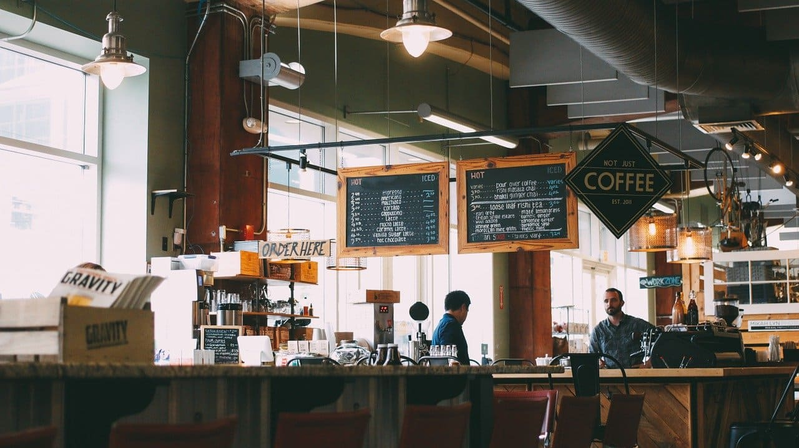
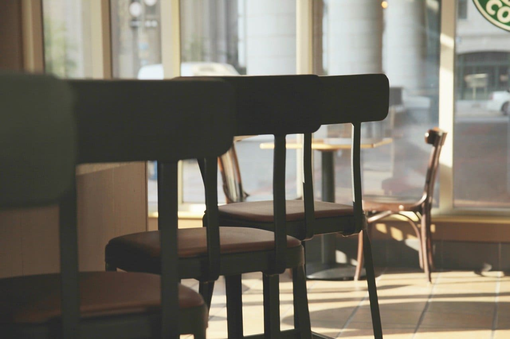

# ZeroPlus Gate - Cafe Website

ZeroPlusのWeb制作講座で作成した、架空カフェのマルチページWebサイトです。

## 📄 ページ構成

- トップページ（`index.html`）
- メニュー一覧（`menu.html`）
- お知らせ一覧（`info.html`）
- お知らせ詳細（`info-single.html`）

## 🛠 使用技術

- HTML5 / CSS3
- Google Fonts（Noto Sans JP）
- Flexbox
- ページ遷移アニメーション
- リセットCSS（destyle.css）

## 🎯 コンセプト

温かみのある色使いと、柔らかいフォント・画像構成で「落ち着く空間」を演出するカフェLPサイトです。メニュー一覧やお知らせ詳細など、実際のWebサイト運用を意識した構造を設計しました。

## 🌍 公開URL

[https://marushin0504.github.io/cafe-website/](https://marushin0504.github.io/cafe-website/)

## 📸 スクリーンショット

| トップ | メニュー | お知らせ |
|--------|----------|----------|
|  |  |  |

## 📝 備考

デザイン・テキスト・ロゴはすべて架空のものであり、実在の団体・企業とは関係ありません。
